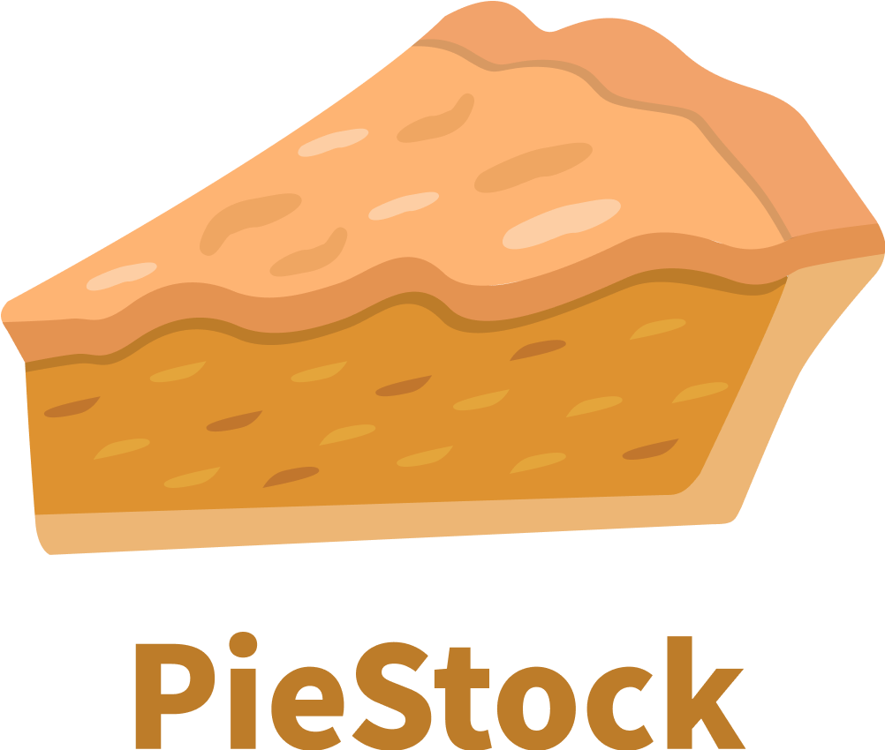
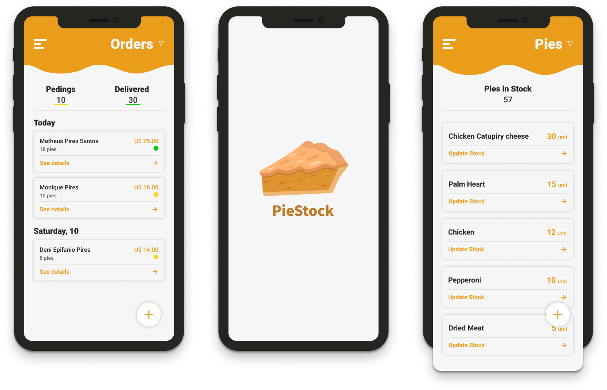

<p align="center">
  
	
  <p align="center">
  PieStock is an app to control the stock of pies, bringing productivity to micro-entrepreneurs!
  </p>
  
  
</p>

## Development
> **yarn** is required

After cloning this repo
### Backend
- Open the **backend** folder and run ```yarn```
- Run ```yarn dev``` to up the server
- Open ```Insomnia``` or ```Postman``` and import the ```Insomnia.json``` workspace file at ```backend``` folder

### Mobile
#### Android
 - Start **Android** Emulator
 - Open the **mobile** folder and run ```yarn``` to install packages
 - Run ```yarn android``` and have fun!

#### IOS
 - Start **IOS** Emulator
 - Open the **mobile** folder and run ```yarn``` to install packages
 - Run ```npx pod-install ios```
 - Run ```yarn ios``` and have fun!
